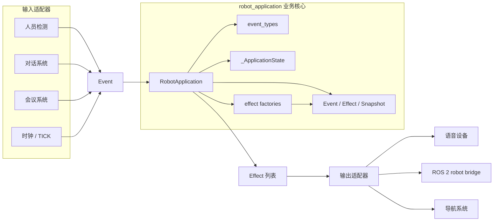

# 架构设计

## 设计目标

业务核心只负责把输入 `Event` 转换为本次事件新产生的 `Effect`。事件来源和效果执行均位于边界之外，因此核心代码可以脱离 ROS 2、相机、语音设备和机器人硬件独立测试。

## 模块与依赖方向

依赖只指向业务核心，核心不反向依赖任何输入或输出技术。`models.py` 位于最内层，其他模块可以依赖它，但它不依赖业务服务或基础设施。

## 模块职责与边界

| 模块 | 负责 | 不负责 |
|---|---|---|
| `models.py` | 定义不可变的 `Event`、`Effect` 和快照结构 | 状态转换、设备调用、事件采集 |
| `event_types.py` | 集中维护允许的事件名称 | 解释事件含义或执行规则 |
| `state.py` | 保存单个应用实例的内部状态，提供派生的在场及抑制判断 | 产生效果、访问外部系统 |
| `effects.py` | 构造欢迎和送客效果，集中管理效果类型与文案 | 判断何时产生效果、真正播放语音或动作 |
| `application.py` | 验证事件、执行状态转换、协调规则并返回本次新增效果 | ROS 2 通信、硬件重试、持久化、人员识别 |
| 输入适配器 | 将相机、对话、会议和时钟信号转换成 `Event` | 修改核心内部状态 |
| 输出适配器 | 将 `Effect` 映射到语音、动作或导航调用，跟踪执行结果 | 决定迎宾和送客业务规则 |

## 状态归属

每个 `RobotApplication` 在构造时创建独立的 `_ApplicationState`，没有全局可变状态。

| 状态 | 所有者 | 用途 |
|---|---|---|
| `present_person_ids` | `_ApplicationState` | 记录当前人员；只有最后一人离开才启动离场计时 |
| `reception_active` | `_ApplicationState` | 标识同一接待周期，防止重复迎宾并区分新接待 |
| `conversation_active` | `_ApplicationState` | 独立记录对话抑制状态 |
| `meeting_active` | `_ApplicationState` | 独立记录会议抑制状态；不会被对话结束事件误清除 |
| `absence_started_at` | `_ApplicationState` | 保存最后一人离开的时间戳 |
| `farewell_sent` | `_ApplicationState` | 记录当前周期是否已经产生送客效果 |
| `absence_timeout_s` | `RobotApplication` | 保存实例级离场确认阈值 |

应用不启动内部线程。外部时钟拥有调度职责并发送 `TICK`；应用只比较事件时间戳与 `absence_started_at`。离场一旦确认，接待周期立即结束，因此后续 `TICK` 不会重复送客。若确认时正在对话或会议中，离场仍被确认但不产生效果，从而避免结束后补发。

`snapshot()` 每次创建新字典，并把内部人员集合转换为不可变元组。调用方得到的快照不包含应用拥有的可变引用。

## 扩展方式

### VIP

增加独立的 `VisitorProfileProvider` 端口，由外部适配器根据 `person_id` 查询身份。欢迎策略可以通过 `GreetingPolicy` 接口选择普通或 VIP 文案；`RobotApplication` 只调用策略，不直接访问人脸库、CRM 或网络服务。

### RAG

RAG 属于独立的对话应用服务，负责检索、生成、超时和内容安全。它通过对话开始/结束事件影响迎宾应用，并通过自己的语音效果输出答案，不把向量库客户端或提示词逻辑放入 `RobotApplication`。

### ROS 2 导航和动作

增加输出适配器消费 `Effect`，把动作或导航意图映射为 ROS 2 Action 请求。适配器拥有连接、任务 ID、反馈、超时、重试和取消逻辑，并把完成或失败结果转换成新的领域事件。业务核心继续不导入 `rclpy` 或机器人 SDK。

### 避免形成大类

当规则增加时，将问候选择、输出抑制、离场策略和访客画像分别抽成小型策略接口；`RobotApplication` 保持为用例协调器。基础设施能力通过端口和适配器扩展，而不是继续向应用类添加摄像头、RAG、ROS 2 或数据库代码。

## 当前假设

- 输入适配器按时间顺序发送事件，并使用同一时间基准；核心允许较早的 `TICK`，但不负责重排乱序事件。
- 相同 `person_id` 的重复进入视为重复检测。`person_id=None` 表示一个匿名在场身份。
- 不同人员在离场确认前进入，仍属于同一接待周期。
- 题目未指定送客文案，本实现使用 `SPEECH / 欢迎下次光临`。
- 未知事件类型和非有限时间戳被视为输入错误并明确拒绝。
